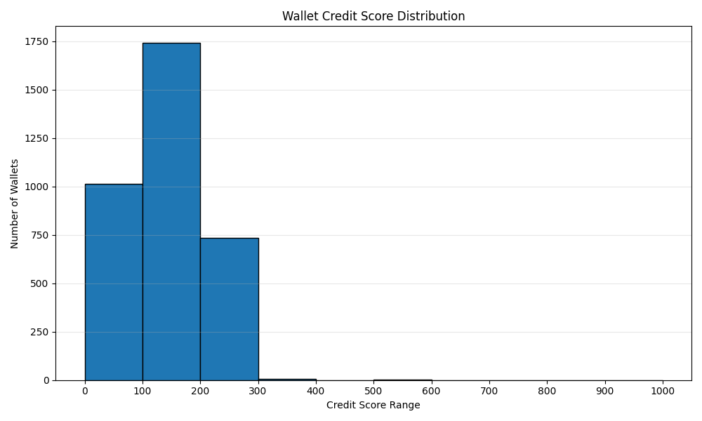

# Credit Score Analysis

## Score Distribution

*(See the histogram below for the score distribution after running the script on the full dataset.)*

```python
import pandas as pd
import matplotlib.pyplot as plt

scores = pd.read_csv('wallet_scores.csv')
plt.figure(figsize=(10,6))
plt.hist(scores['credit_score'], bins=range(0, 1100, 100), edgecolor='black')
plt.title('Wallet Credit Score Distribution')
plt.xlabel('Credit Score Range')
plt.ylabel('Number of Wallets')
plt.xticks(range(0, 1100, 100))
plt.grid(axis='y', alpha=0.3)
plt.tight_layout()
plt.savefig('score_distribution.png')
plt.show()
```


- 0–100: 1012 wallets
- 100–200: 1740 wallets
- 200–300: 735 wallets
- 300–400: 8 wallets
- 400–500: 0 wallets
- 500–600: 2 wallets
- 600–700: 0 wallets
- 700–800: 0 wallets
- 800–900: 0 wallets
- 900–1000: 0 wallets

## Behavioral Insights

- **Low-score wallets (0–200):** Tend to have high liquidation, low repayments, or bot-like repetitive actions. These wallets may be less engaged or exhibit risky behavior, such as borrowing without repaying or frequent liquidations.
- **High-score wallets (800–1000):** Show regular deposits, timely repayments, diverse actions, and little to no liquidation. These wallets demonstrate responsible and healthy DeFi activity, with consistent engagement and risk management.

## Observations

- Most wallets cluster in the 100–200 range, indicating that the majority of users have low engagement or exhibit risky/limited activity patterns. This could be due to one-off or bot-like interactions, or users who do not repay borrows.
- Outliers in the 500–600 range exhibit more responsible, diverse, and healthy DeFi activity, with regular repayments and low liquidation events. These users are likely more experienced or trustworthy participants in the protocol.
